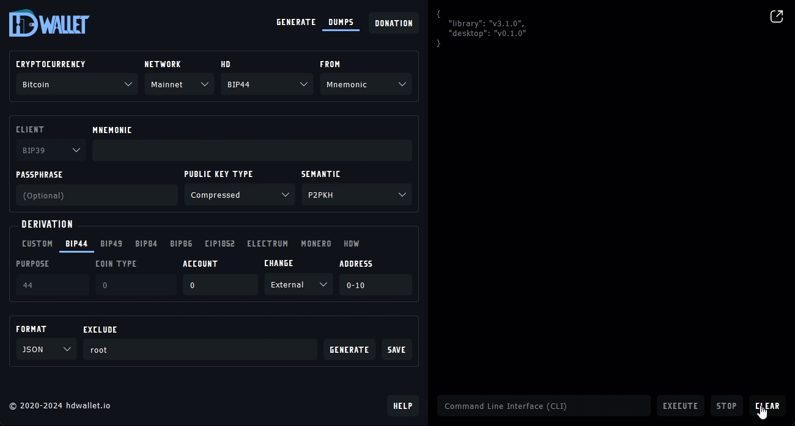

<h1 align="center" style="border-bottom: none">
    
</h1>

<p align="center">
    <a href="https://github.com/talonlab/hdwallet-desktop/releases" target="_blank">Releases</a> · <a href="https://talonlab.gitbook.io/hdwallet/manual" target="_blank">Manual</a> ·  <a href="#donations">Donation</a>
</p>

<div align="center">


</div>

A cross-platform client desktop application built on the [Hierarchical Deterministic (HD) Wallet Library](https://github.com/talonlab/python-hdwallet). This application leverages the Python-based library for the implementation of a hierarchical deterministic wallet generator for more than 200 multiple cryptocurrencies. 




## Installation

### For Windows (64-bit)

To install on Windows, download one of the following from the Releases page:

- MSI Installer– Recommended for a guided installation process.

- Executable (.exe) – A standalone version that runs without installation.

Once downloaded, double-click the .msi or .exe file and follow the on-screen instructions to complete the installation.

### For Linux

To install on Linux, download one of the following from the Releases page:

Note: For ubuntu >= 22.04 install required libraries

```
sudo apt-get update
sudo apt-get install libxcb-cursor0 libxcb-cursor-dev
```


- Debian Package (.deb) – Recommended for Debian-based systems like Ubuntu and Debian.

    Installation: Open a terminal, navigate to the download location, and run:
    ```
    sudo dpkg -i hdwallet-desktop-x.x.x-amd64.deb
    ```

- AppImage– A portable format compatible with most Linux distributions.

    Installation: Make the file executable and run:
    ```
    chmod +x hdwallet-desktop-x.x.x-x86_64.AppImage
    ```
    ```
    ./hdwallet-desktop-x.x.x-x86_64.AppImage
    ```

### For Mac

To install on Mac, download one of the following from the Releases page:

1. **Install OpenSSL** (a required dependency if not already installed):
```bash
brew install openssl
```
2. **Set up OpenSSL** environment variables to ensure it is correctly linked for development:
```bash
echo 'export LDFLAGS=-L$(brew --prefix openssl)/lib' >> ~/.zshrc
echo 'export CPPFLAGS=-I$(brew --prefix openssl)/include' >> ~/.zshrc
echo 'export PKG_CONFIG_PATH=$(brew --prefix openssl)/lib/pkgconfig' >> ~/.zshrc
echo 'export PATH=$(brew --prefix openssl)/bin:$PATH' >> ~/.zshrc
source ~/.zshrc
```

- MacOS App Bundle (.app):
   - Available as a `.zip` file.
   - Two versions:
     - **ARM64**: For Apple Silicon `M` series devices.
     - **x64**: For Intel-based Macs.

- MacOS Disk Image (.dmg):
   - A convenient format for installation on macOS.
   - Two versions:
     - **ARM64**: For Apple Silicon `M` series devices.
     - **x64**: For Intel-based Macs.


## Development

Fork the Repository: Fork this repository to your GitHub account.

Clone Locally: Clone the repository to your local machine. You can also clone the latest development version directly from GitHub:

```
git clone https://github.com/talonlab/hdwallet-desktop.git
```

Install Requirements: Navigate to the project directory and install the required dependencies:

```
pip install -r requirements.txt
```


## Contributing

Feel free to open an [issue](https://github.com/talonlab/hdwallet-desktop/issues) if you find a problem,
or a pull request if you've solved an issue. And also any help in testing, development,
documentation and other tasks is highly appreciated and useful to the project.
There are tasks for contributors of all experience levels.


## Donations

Your contributions help us maintain and improve this tool for the community. 
If you find our work helpful, consider supporting the project:

- **Bitcoin** - 16c7ajUwHEMaafrceuYSrd35SDjmfVdjoS
- **Ethereum / ERC20** - 0xD3cbCB0B6F82A03C715D665b72dC44CEf54e6D9B
- **Solana** - 9cVoan5GvnpVvysEkFWEFR4k9cpTdWKmqQ6Gi7nwM5ES

We accept a wide range of cryptocurrencies! If you'd like to donate using another coin, generate an address using the following ECC public keys at [hdwallet.online](https://hdwallet.online):

| **ECC**                | **Public Key**                                                                 | **Online**                                                                                                                                                                                                                                                                                                                                 |
|------------------------|--------------------------------------------------------------------------------|--------------------------------------------------------------------------------------------------------------------------------------------------------------------------------------------------------------------------------------------------------------------------------------------------------------------------------------------|
| SLIP10-Secp256k1       | `029890465120fb6c4efecdfcfd149f8333b0929b98976722a28ee39f5344d29eee`           | [generate](https://hdwallet.online/dumps/slip10-secp256k1/BTC?network=mainnet&hd=BIP32&from=public-key&public-key=029890465120fb6c4efecdfcfd149f8333b0929b98976722a28ee39f5344d29eee&public-key-type=compressed&format=JSON&exclude=root&generate=true)                                                                                    |
| SLIP10-Ed25519         | `007ff5643c73e46e6c6a0dfd702894610505423e145dc8a93df19ff44eb011323b`           | [generate](https://hdwallet.online/dumps/slip10-ed25519/ALGO?network=mainnet&hd=BIP32&from=public-key&public-key=007ff5643c73e46e6c6a0dfd702894610505423e145dc8a93df19ff44eb011323b&format=JSON&exclude=root&generate=true)                                                                                                                |
| Kholaw-Ed25519         | `005a49188ccd3d841dd877d7c00078da5c90452cbd69d4cef7a959f679fcc0e0e3`           | [generate](https://hdwallet.online/dumps/kholaw-ed25519/ADA?network=mainnet&hd=Cardano&from=public-key&public-key=005a49188ccd3d841dd877d7c00078da5c90452cbd69d4cef7a959f679fcc0e0e3&staking-public-key=005a49188ccd3d841dd877d7c00078da5c90452cbd69d4cef7a959f679fcc0e0e3&address-type=payment&format=JSON&exclude=root&generate=true)    |
| SLIP10-Ed25519-Blake2b | `0051e8b29f7d0214dc96843cdbdcc071dc65397016ea6f7381f81bf42d76c7357c`           | [generate](https://hdwallet.online/dumps/slip10-ed25519-blake2b/XNO?network=mainnet&hd=BIP32&from=public-key&public-key=0051e8b29f7d0214dc96843cdbdcc071dc65397016ea6f7381f81bf42d76c7357c&format=JSON&exclude=root&generate=true)                                                                                                         |
| SLIP10-Nist256p1       | `039ee4e2aadd6f4e7938d164b646c4b424114b8dd57252287151398ba0baf25780`           | [generate](https://hdwallet.online/dumps/slip10-nist256p1/NEO?network=mainnet&hd=BIP32&from=public-key&public-key=039ee4e2aadd6f4e7938d164b646c4b424114b8dd57252287151398ba0baf25780&format=JSON&exclude=root&generate=true)                                                                                                               |


Thank you very much for your support.

## License

Distributed under the [MIT](https://github.com/talonlab/hdwallet-desktop/blob/master/LICENSE) license. See ``LICENSE`` for more information.

## Terms and Conditions

By using this project, you agree to the [Terms and Conditions](https://talonlab.gitbook.io/hdwallet/terms-and-conditions).

## Privacy Policy

To understand how your data is used, please review our [Privacy Policy](https://talonlab.gitbook.io/hdwallet/privacy-policy).